# 银行业务管理系统

[TOC]

## 1. 概述

### 1.1 系统目标

> 概述本系统的主要开发目标。

开发一个银行业务管理系统，支持客户管理、账户管理、贷款管理和部分业务统计功能。

### 1.2 需求说明

> 说明本系统的主要功能需求。

- 客户管理:提供客户所有信息的增、删、改、查功能;如果客户存在着关联账户或者贷款记录,则不允许删除;

- 账户管理:提供账户开户、销户、修改、查询功能,包括储蓄账户和支票账户;账户号不允许修改;

- 贷款管理:提供贷款信息的增、删、查功能,提供贷款发放功能;贷款信息一旦添加成功后不允许修改;要求能查询每笔贷款的当前状态(未开始发放、发放中、已全部发放);处于发放中状态的贷款记录不允许删除;

- 业务统计:按业务分类(储蓄、贷款)和时间(月、季、年)统计各个支行的业务总金额和用户数,要求对统计结果同时提供表格和曲线图两种可视化展示方式。

### 1.3 本报告的主要贡献

> 概述本报告的主要内容。

本报告主要包含：

- 系统整体模块设计；
- 数据库 ER 模型和具体设计方案；
- 重点模块（如 API 接口设计）的设计细节；
- 各个功能的测试

## 2. 总体设计

### 2.1 系统模块结构

> 给出本系统的模块结构图，包括各级子模块，以及模块之间的接口关系。定义每个模块的基本功能。



如上图，各个模块及其功能如下。

- 前端：接收用户的请求并通过路由返回适当的页面以在浏览器上展示，向后端接口发送 XHR 请求并根据返回值修改网页的显示内容；
- 后端：接收 XHR 请求，和数据库交互，并返回信息给前端；
  - Flask：接受请求，处理相应路由，通过和 Flask-SQLAlchemy 交互来更改数据库并返回信息；
  - Flask-SQLAlchemy：Flask 和底层数据库引擎的交互媒介（ORM），大大简化对数据库的相关操作；
  - Database Engine：数据库引擎，用于处理底层数据库操作；

### 2.2 系统工作流程

> 给出系统工作流程图。

仍看上图，箭头的数字表示了一个用户访问的过程：

1. 用户打开浏览器，输入网址并访问；
2. 浏览器获取到前端页面信息，向后台 API 发送 XHR 请求；
3. 后台 API 接受到请求，给与相应的回应；
4. 浏览器获取到接口的返回信息，填充到网页的适当位置，呈现给用户。

> 事实上，”1“完成之后，用户立即可以看到网页内容，但此时的页面还没有被填充上从后台接口获取到的数据，因此，这里的”4“指的是”完整“的网页内容。

### 2.3 数据库设计

> 给出数据库设计 ER 图，逻辑数据库结构，以及最终的物理数据库结构。如果采用了特殊的物理数据库结构设计，例如分表、增加了冗余属性等，要求解释理由。

#### 2.3.1 ER 图


#### 2.3.2 具体设计

##### User


```json
{
  "username": "string",
  "password": "string"
}

```
| Name     | Type   | Required | Restrictions | Description |
| -------- | ------ | -------- | ------------ | ----------- |
| username | string | false    | none         | none        |
| password | string | false    | none         | none        |

##### Token


```json
{
  "token": "string",
  "expires": 0,
  "user_ref": "string"
}

```
| Name     | Type                                                        | Required | Restrictions | Description |
| -------- | ----------------------------------------------------------- | -------- | ------------ | ----------- |
| token    | string                                                      | false    | none         | none        |
| expires  | integer                                                     | false    | none         | none        |
| user_ref | [User/properties/username](#schemauser/properties/username) | false    | none         | none        |

##### Client


```json
{
  "id_number": "string",
  "name": "string",
  "phone_number": "string",
  "address": "string",
  "contact_name": "string",
  "contact_phone_number": "string",
  "contact_email": "string",
  "contact_relationship": "string",
  "staff_ref": "string"
}

```
| Name                 | Type                                                         | Required | Restrictions | Description |
| -------------------- | ------------------------------------------------------------ | -------- | ------------ | ----------- |
| id_number            | string                                                       | false    | none         | none        |
| name                 | string                                                       | false    | none         | none        |
| phone_number         | string                                                       | false    | none         | none        |
| address              | string                                                       | false    | none         | none        |
| contact_name         | string                                                       | false    | none         | none        |
| contact_phone_number | string                                                       | false    | none         | none        |
| contact_email        | string                                                       | false    | none         | none        |
| contact_relationship | string                                                       | false    | none         | none        |
| staff_ref            | [Staff/properties/id_number](#schemastaff/properties/id_number) | false    | none         | none        |

##### Account


```json
{
  "id": "string",
  "balance": 0,
  "open_date": 0,
  "account_type": "string",
  "bank_ref": "string"
}

```
| Name         | Type                                                | Required | Restrictions | Description |
| ------------ | --------------------------------------------------- | -------- | ------------ | ----------- |
| id           | string                                              | false    | none         | none        |
| balance      | number                                              | false    | none         | none        |
| open_date    | integer                                             | false    | none         | none        |
| account_type | string                                              | false    | none         | none        |
| bank_ref     | [Bank/properties/name](#schemabank/properties/name) | false    | none         | none        |

##### DepositAccount


```json
{
  "id_ref": "string",
  "interest_rate": 0,
  "currency_kind": "string"
}

```
| Name          | Type                                                  | Required | Restrictions | Description |
| ------------- | ----------------------------------------------------- | -------- | ------------ | ----------- |
| id_ref        | [Account/properties/id](#schemaaccount/properties/id) | false    | none         | none        |
| interest_rate | number                                                | false    | none         | none        |
| currency_kind | string                                                | false    | none         | none        |

##### ChequeAccount


```json
{
  "id_ref": "string",
  "overdraft": 0
}

```
| Name      | Type                                                  | Required | Restrictions | Description |
| --------- | ----------------------------------------------------- | -------- | ------------ | ----------- |
| id_ref    | [Account/properties/id](#schemaaccount/properties/id) | false    | none         | none        |
| overdraft | number                                                | false    | none         | none        |

##### ClientAccountAssociation


```json
{
  "client_ref": "string",
  "account_ref": "string",
  "last_visit_date": 0
}

```
| Name            | Type                                                         | Required | Restrictions | Description |
| --------------- | ------------------------------------------------------------ | -------- | ------------ | ----------- |
| client_ref      | [Client/properties/id_number](#schemaclient/properties/id_number) | false    | none         | none        |
| account_ref     | [Account/properties/id](#schemaaccount/properties/id)        | false    | none         | none        |
| last_visit_date | number                                                       | false    | none         | none        |

##### Staff


```json
{
  "id_number": "string",
  "name": "string",
  "phone_number": "string",
  "address": "string",
  "joined_date": 0,
  "kind": "string",
  "department_ref": 0
}

```
| Name           | Type                                                        | Required | Restrictions | Description |
| -------------- | ----------------------------------------------------------- | -------- | ------------ | ----------- |
| id_number      | string                                                      | false    | none         | none        |
| name           | string                                                      | false    | none         | none        |
| phone_number   | string                                                      | false    | none         | none        |
| address        | string                                                      | false    | none         | none        |
| joined_date    | integer                                                     | false    | none         | none        |
| kind           | string                                                      | false    | none         | none        |
| department_ref | [Department/properties/id](#schemadepartment/properties/id) | false    | none         | none        |

##### Department


```json
{
  "id": 0,
  "name": "string",
  "kind": "string"
}

```
| Name | Type    | Required | Restrictions | Description |
| ---- | ------- | -------- | ------------ | ----------- |
| id   | integer | false    | none         | none        |
| name | string  | false    | none         | none        |
| kind | string  | false    | none         | none        |

##### Bank


```json
{
  "name": "string",
  "city": "string"
}

```
| Name | Type   | Required | Restrictions | Description |
| ---- | ------ | -------- | ------------ | ----------- |
| name | string | false    | none         | none        |
| city | string | false    | none         | none        |

##### Loan


```json
{
  "id": 0,
  "money": 0,
  "status": "string",
  "bank_ref": "string"
}

```
| Name     | Type                                                | Required | Restrictions | Description |
| -------- | --------------------------------------------------- | -------- | ------------ | ----------- |
| id       | integer                                             | false    | none         | none        |
| money    | number                                              | false    | none         | none        |
| status   | string                                              | false    | none         | none        |
| bank_ref | [Bank/properties/name](#schemabank/properties/name) | false    | none         | none        |

##### LoanClientAssociation


```json
{
  "loan_ref": 0,
  "client_ref": "string"
}

```
| Name       | Type                                                         | Required | Restrictions | Description |
| ---------- | ------------------------------------------------------------ | -------- | ------------ | ----------- |
| loan_ref   | [Loan/properties/id](#schemaloan/properties/id)              | false    | none         | none        |
| client_ref | [Client/properties/id_number](#schemaclient/properties/id_number) | false    | none         | none        |

##### Payment


```json
{
  "id": 0,
  "pay_date": 0,
  "money": 0,
  "loan_ref": 0
}

```
| Name     | Type                                            | Required | Restrictions | Description |
| -------- | ----------------------------------------------- | -------- | ------------ | ----------- |
| id       | integer                                         | false    | none         | none        |
| pay_date | integer                                         | false    | none         | none        |
| money    | number                                          | false    | none         | none        |
| loan_ref | [Loan/properties/id](#schemaloan/properties/id) | false    | none         | none        |

## 3. 详细设计

> 一个模块一个小节，给出该模块的输入、输出和程序流程图。

### 3.1 API

**输入**：`GET/POST/PUT/DELETE https://bank.yusanshi.com/api/v1/<endpoint>`，HTTP request header, HTTP request body

**输出**：HTTP response (application/json)


> 状态码约定：为简化设计，除了 `200:OK`（请求成功时）和 `401:Unauthorized`（登录时账号或密码不正确，或请求时 token 不正确时）外，其他的报错都返回 `422:Unprocessable Entity`，但返回 422 的同时须在 body 中返回报错信息供客户端显示（若客户端在使用部分接口时，需对都返回 422 的不同结果做区分，则再对相关接口另行设置状态码）。

> 数据库设计：`XXX_ref` 表示一个 Foreign key。

Base URLs:

* <a href="https://bank.yusanshi.com/api/v1">https://bank.yusanshi.com/api/v1</a>

Email: <a href="mailto:yulei2018@gmail.com">Support</a> 
License: <a href="https://opensource.org/licenses/MIT">MIT</a>

#### user

##### `POST /user/login`

*登录，获取 token*

> Body parameter

```json
{
  "username": "string",
  "password": "string"
}
```

**Parameters**

| Name       | In   | Type   | Required | Description |
| ---------- | ---- | ------ | -------- | ----------- |
| body       | body | object | false    | none        |
| » username | body | string | false    | none        |
| » password | body | string | false    | none        |

> Example responses

> 200 Response

```json
{
  "token": "string",
  "expires": 0
}
```

**Responses**

| Status | Meaning                                                      | Description                                      | Schema |
| ------ | ------------------------------------------------------------ | ------------------------------------------------ | ------ |
| 200    | [OK](https://tools.ietf.org/html/rfc7231#section-6.3.1)      | 登录成功                                         | Inline |
| 401    | [Unauthorized](https://tools.ietf.org/html/rfc7235#section-3.1) | 账号或密码错误                                   | Inline |
| 422    | [Unprocessable Entity](https://tools.ietf.org/html/rfc2518#section-10.3) | 请求失败（General，应在 message 中附上报错信息） | Inline |

**Response Schema**

Status Code **200**

| Name      | Type    | Required | Restrictions | Description        |
| --------- | ------- | -------- | ------------ | ------------------ |
| » token   | string  | false    | none         | none               |
| » expires | integer | false    | none         | 有效期（单位：秒） |

Status Code **401**

| Name      | Type   | Required | Restrictions | Description |
| --------- | ------ | -------- | ------------ | ----------- |
| » message | string | false    | none         | none        |

**Enumerated Values**

| Property | Value          |
| -------- | -------------- |
| message  | 账号或密码错误 |

Status Code **422**

| Name      | Type   | Required | Restrictions | Description |
| --------- | ------ | -------- | ------------ | ----------- |
| » message | string | false    | none         | none        |

<aside class="success">
This operation does not require authentication
</aside>

##### `POST /user/logout`

*退出，使 token 失效。token 无效并不报错*

**Parameters**

| Name    | In     | Type   | Required | Description |
| ------- | ------ | ------ | -------- | ----------- |
| X-Token | header | string | false    | none        |

> Example responses

> 401 Response

```json
{
  "message": "token 信息无效"
}
```

**Responses**

| Status | Meaning                                                      | Description                                      | Schema |
| ------ | ------------------------------------------------------------ | ------------------------------------------------ | ------ |
| 200    | [OK](https://tools.ietf.org/html/rfc7231#section-6.3.1)      | 退出成功                                         | None   |
| 401    | [Unauthorized](https://tools.ietf.org/html/rfc7235#section-3.1) | token 信息无效                                   | Inline |
| 422    | [Unprocessable Entity](https://tools.ietf.org/html/rfc2518#section-10.3) | 请求失败（General，应在 message 中附上报错信息） | Inline |

**Response Schema**

Status Code **401**

| Name      | Type   | Required | Restrictions | Description |
| --------- | ------ | -------- | ------------ | ----------- |
| » message | string | false    | none         | none        |

**Enumerated Values**

| Property | Value          |
| -------- | -------------- |
| message  | token 信息无效 |

Status Code **422**

| Name      | Type   | Required | Restrictions | Description |
| --------- | ------ | -------- | ------------ | ----------- |
| » message | string | false    | none         | none        |

<aside class="success">
This operation does not require authentication
</aside>

##### `POST /user/password`

> Body parameter

```json
{
  "old_password": "string",
  "new_password": "string"
}
```

**Parameters**

| Name           | In     | Type   | Required | Description |
| -------------- | ------ | ------ | -------- | ----------- |
| X-Token        | header | string | false    | none        |
| body           | body   | object | false    | none        |
| » old_password | body   | string | false    | none        |
| » new_password | body   | string | false    | none        |

> Example responses

> 401 Response

```json
{
  "message": "token 信息无效"
}
```

**Responses**

| Status | Meaning                                                      | Description                                      | Schema |
| ------ | ------------------------------------------------------------ | ------------------------------------------------ | ------ |
| 200    | [OK](https://tools.ietf.org/html/rfc7231#section-6.3.1)      | 修改成功                                         | None   |
| 401    | [Unauthorized](https://tools.ietf.org/html/rfc7235#section-3.1) | token 信息无效                                   | Inline |
| 422    | [Unprocessable Entity](https://tools.ietf.org/html/rfc2518#section-10.3) | 请求失败（General，应在 message 中附上报错信息） | Inline |

**Response Schema**

Status Code **401**

| Name      | Type   | Required | Restrictions | Description |
| --------- | ------ | -------- | ------------ | ----------- |
| » message | string | false    | none         | none        |

**Enumerated Values**

| Property | Value          |
| -------- | -------------- |
| message  | token 信息无效 |

Status Code **422**

| Name      | Type   | Required | Restrictions | Description |
| --------- | ------ | -------- | ------------ | ----------- |
| » message | string | false    | none         | none        |

<aside class="success">
This operation does not require authentication
</aside>

#### client

##### `GET /client/`

**Parameters**

| Name    | In     | Type   | Required | Description |
| ------- | ------ | ------ | -------- | ----------- |
| X-Token | header | string | false    | none        |

> Example responses

> 200 Response

```json
[
  {
    "id_number": "string",
    "name": "string",
    "phone_number": "string",
    "address": "string",
    "contact_name": "string",
    "contact_phone_number": "string",
    "contact_email": "string",
    "contact_relationship": "string",
    "staff_ref": "string",
    "client_account_associations": [
      {
        "client_ref": "string",
        "account_ref": "string",
        "last_visit_date": 0
      }
    ]
  }
]
```

**Responses**

| Status | Meaning                                                      | Description                                      | Schema |
| ------ | ------------------------------------------------------------ | ------------------------------------------------ | ------ |
| 200    | [OK](https://tools.ietf.org/html/rfc7231#section-6.3.1)      | 获取成功                                         | Inline |
| 401    | [Unauthorized](https://tools.ietf.org/html/rfc7235#section-3.1) | token 信息无效                                   | Inline |
| 422    | [Unprocessable Entity](https://tools.ietf.org/html/rfc2518#section-10.3) | 请求失败（General，应在 message 中附上报错信息） | Inline |

**Response Schema**

Status Code **401**

| Name      | Type   | Required | Restrictions | Description |
| --------- | ------ | -------- | ------------ | ----------- |
| » message | string | false    | none         | none        |

**Enumerated Values**

| Property | Value          |
| -------- | -------------- |
| message  | token 信息无效 |

Status Code **422**

| Name      | Type   | Required | Restrictions | Description |
| --------- | ------ | -------- | ------------ | ----------- |
| » message | string | false    | none         | none        |

<aside class="success">
This operation does not require authentication
</aside>

##### `POST /client/`

> Body parameter

```json
{
  "id_number": "string",
  "name": "string",
  "phone_number": "string",
  "address": "string",
  "contact_name": "string",
  "contact_phone_number": "string",
  "contact_email": "string",
  "contact_relationship": "string",
  "staff_ref": "string",
  "client_account_associations": [
    {
      "client_ref": "string",
      "account_ref": "string",
      "last_visit_date": 0
    }
  ]
}
```

**Parameters**

| Name    | In     | Type   | Required | Description |
| ------- | ------ | ------ | -------- | ----------- |
| X-Token | header | string | false    | none        |
| body    | body   | any    | false    | none        |

> Example responses

> 401 Response

```json
{
  "message": "token 信息无效"
}
```

**Responses**

| Status | Meaning                                                      | Description                                      | Schema |
| ------ | ------------------------------------------------------------ | ------------------------------------------------ | ------ |
| 200    | [OK](https://tools.ietf.org/html/rfc7231#section-6.3.1)      | 添加成功                                         | None   |
| 401    | [Unauthorized](https://tools.ietf.org/html/rfc7235#section-3.1) | token 信息无效                                   | Inline |
| 422    | [Unprocessable Entity](https://tools.ietf.org/html/rfc2518#section-10.3) | 请求失败（General，应在 message 中附上报错信息） | Inline |

**Response Schema**

Status Code **401**

| Name      | Type   | Required | Restrictions | Description |
| --------- | ------ | -------- | ------------ | ----------- |
| » message | string | false    | none         | none        |

**Enumerated Values**

| Property | Value          |
| -------- | -------------- |
| message  | token 信息无效 |

Status Code **422**

| Name      | Type   | Required | Restrictions | Description |
| --------- | ------ | -------- | ------------ | ----------- |
| » message | string | false    | none         | none        |

<aside class="success">
This operation does not require authentication
</aside>

##### `PUT /client/{id_number}`

> Body parameter

```json
{
  "id_number": "string",
  "name": "string",
  "phone_number": "string",
  "address": "string",
  "contact_name": "string",
  "contact_phone_number": "string",
  "contact_email": "string",
  "contact_relationship": "string",
  "staff_ref": "string",
  "client_account_associations": [
    {
      "client_ref": "string",
      "account_ref": "string",
      "last_visit_date": 0
    }
  ]
}
```

**Parameters**

| Name      | In     | Type                                                         | Required | Description |
| --------- | ------ | ------------------------------------------------------------ | -------- | ----------- |
| id_number | path   | [Client/properties/id_number](#schemaclient/properties/id_number) | true     | none        |
| X-Token   | header | string                                                       | false    | none        |
| body      | body   | any                                                          | false    | none        |

> Example responses

> 401 Response

```json
{
  "message": "token 信息无效"
}
```

**Responses**

| Status | Meaning                                                      | Description                                      | Schema |
| ------ | ------------------------------------------------------------ | ------------------------------------------------ | ------ |
| 200    | [OK](https://tools.ietf.org/html/rfc7231#section-6.3.1)      | 修改成功                                         | None   |
| 401    | [Unauthorized](https://tools.ietf.org/html/rfc7235#section-3.1) | token 信息无效                                   | Inline |
| 422    | [Unprocessable Entity](https://tools.ietf.org/html/rfc2518#section-10.3) | 请求失败（General，应在 message 中附上报错信息） | Inline |

**Response Schema**

Status Code **401**

| Name      | Type   | Required | Restrictions | Description |
| --------- | ------ | -------- | ------------ | ----------- |
| » message | string | false    | none         | none        |

**Enumerated Values**

| Property | Value          |
| -------- | -------------- |
| message  | token 信息无效 |

Status Code **422**

| Name      | Type   | Required | Restrictions | Description |
| --------- | ------ | -------- | ------------ | ----------- |
| » message | string | false    | none         | none        |

<aside class="success">
This operation does not require authentication
</aside>

##### `DELETE /client/{id_number}`

**Parameters**

| Name      | In     | Type                                                         | Required | Description |
| --------- | ------ | ------------------------------------------------------------ | -------- | ----------- |
| id_number | path   | [Client/properties/id_number](#schemaclient/properties/id_number) | true     | none        |
| X-Token   | header | string                                                       | false    | none        |

> Example responses

> 401 Response

```json
{
  "message": "token 信息无效"
}
```

**Responses**

| Status | Meaning                                                      | Description                                      | Schema |
| ------ | ------------------------------------------------------------ | ------------------------------------------------ | ------ |
| 200    | [OK](https://tools.ietf.org/html/rfc7231#section-6.3.1)      | 删除成功                                         | None   |
| 401    | [Unauthorized](https://tools.ietf.org/html/rfc7235#section-3.1) | token 信息无效                                   | Inline |
| 422    | [Unprocessable Entity](https://tools.ietf.org/html/rfc2518#section-10.3) | 请求失败（General，应在 message 中附上报错信息） | Inline |

**Response Schema**

Status Code **401**

| Name      | Type   | Required | Restrictions | Description |
| --------- | ------ | -------- | ------------ | ----------- |
| » message | string | false    | none         | none        |

**Enumerated Values**

| Property | Value          |
| -------- | -------------- |
| message  | token 信息无效 |

Status Code **422**

| Name      | Type   | Required | Restrictions | Description |
| --------- | ------ | -------- | ------------ | ----------- |
| » message | string | false    | none         | none        |

<aside class="success">
This operation does not require authentication
</aside>

#### account

##### `GET /account/`

**Parameters**

| Name    | In     | Type   | Required | Description |
| ------- | ------ | ------ | -------- | ----------- |
| X-Token | header | string | false    | none        |

> Example responses

> 200 Response

```json
[
  {
    "id": "string",
    "balance": 0,
    "open_date": 0,
    "account_type": "string",
    "bank_ref": "string",
    "client_account_associations": [
      {
        "client_ref": "string",
        "account_ref": "string",
        "last_visit_date": 0
      }
    ]
  }
]
```

**Responses**

| Status | Meaning                                                      | Description                                      | Schema |
| ------ | ------------------------------------------------------------ | ------------------------------------------------ | ------ |
| 200    | [OK](https://tools.ietf.org/html/rfc7231#section-6.3.1)      | 获取成功                                         | Inline |
| 401    | [Unauthorized](https://tools.ietf.org/html/rfc7235#section-3.1) | token 信息无效                                   | Inline |
| 422    | [Unprocessable Entity](https://tools.ietf.org/html/rfc2518#section-10.3) | 请求失败（General，应在 message 中附上报错信息） | Inline |

**Response Schema**

Status Code **401**

| Name      | Type   | Required | Restrictions | Description |
| --------- | ------ | -------- | ------------ | ----------- |
| » message | string | false    | none         | none        |

**Enumerated Values**

| Property | Value          |
| -------- | -------------- |
| message  | token 信息无效 |

Status Code **422**

| Name      | Type   | Required | Restrictions | Description |
| --------- | ------ | -------- | ------------ | ----------- |
| » message | string | false    | none         | none        |

<aside class="success">
This operation does not require authentication
</aside>

##### `POST /account/`

> Body parameter

```json
{
  "id": "string",
  "balance": 0,
  "open_date": 0,
  "account_type": "string",
  "bank_ref": "string",
  "client_account_associations": [
    {
      "client_ref": "string",
      "account_ref": "string",
      "last_visit_date": 0
    }
  ]
}
```

**Parameters**

| Name    | In     | Type   | Required | Description |
| ------- | ------ | ------ | -------- | ----------- |
| X-Token | header | string | false    | none        |
| body    | body   | any    | false    | none        |

> Example responses

> 401 Response

```json
{
  "message": "token 信息无效"
}
```

**Responses**

| Status | Meaning                                                      | Description                                      | Schema |
| ------ | ------------------------------------------------------------ | ------------------------------------------------ | ------ |
| 200    | [OK](https://tools.ietf.org/html/rfc7231#section-6.3.1)      | 添加成功                                         | None   |
| 401    | [Unauthorized](https://tools.ietf.org/html/rfc7235#section-3.1) | token 信息无效                                   | Inline |
| 422    | [Unprocessable Entity](https://tools.ietf.org/html/rfc2518#section-10.3) | 请求失败（General，应在 message 中附上报错信息） | Inline |

**Response Schema**

Status Code **401**

| Name      | Type   | Required | Restrictions | Description |
| --------- | ------ | -------- | ------------ | ----------- |
| » message | string | false    | none         | none        |

**Enumerated Values**

| Property | Value          |
| -------- | -------------- |
| message  | token 信息无效 |

Status Code **422**

| Name      | Type   | Required | Restrictions | Description |
| --------- | ------ | -------- | ------------ | ----------- |
| » message | string | false    | none         | none        |

<aside class="success">
This operation does not require authentication
</aside>

##### `PUT /account/{id}`

> Body parameter

```json
{
  "id": "string",
  "balance": 0,
  "open_date": 0,
  "account_type": "string",
  "bank_ref": "string",
  "client_account_associations": [
    {
      "client_ref": "string",
      "account_ref": "string",
      "last_visit_date": 0
    }
  ]
}
```

**Parameters**

| Name    | In     | Type                                                  | Required | Description |
| ------- | ------ | ----------------------------------------------------- | -------- | ----------- |
| id      | path   | [Account/properties/id](#schemaaccount/properties/id) | true     | none        |
| X-Token | header | string                                                | false    | none        |
| body    | body   | any                                                   | false    | none        |

> Example responses

> 401 Response

```json
{
  "message": "token 信息无效"
}
```

**Responses**

| Status | Meaning                                                      | Description                                      | Schema |
| ------ | ------------------------------------------------------------ | ------------------------------------------------ | ------ |
| 200    | [OK](https://tools.ietf.org/html/rfc7231#section-6.3.1)      | 修改成功                                         | None   |
| 401    | [Unauthorized](https://tools.ietf.org/html/rfc7235#section-3.1) | token 信息无效                                   | Inline |
| 422    | [Unprocessable Entity](https://tools.ietf.org/html/rfc2518#section-10.3) | 请求失败（General，应在 message 中附上报错信息） | Inline |

**Response Schema**

Status Code **401**

| Name      | Type   | Required | Restrictions | Description |
| --------- | ------ | -------- | ------------ | ----------- |
| » message | string | false    | none         | none        |

**Enumerated Values**

| Property | Value          |
| -------- | -------------- |
| message  | token 信息无效 |

Status Code **422**

| Name      | Type   | Required | Restrictions | Description |
| --------- | ------ | -------- | ------------ | ----------- |
| » message | string | false    | none         | none        |

<aside class="success">
This operation does not require authentication
</aside>

##### `DELETE /account/{id}`

**Parameters**

| Name    | In     | Type                                                  | Required | Description |
| ------- | ------ | ----------------------------------------------------- | -------- | ----------- |
| id      | path   | [Account/properties/id](#schemaaccount/properties/id) | true     | none        |
| X-Token | header | string                                                | false    | none        |

> Example responses

> 401 Response

```json
{
  "message": "token 信息无效"
}
```

**Responses**

| Status | Meaning                                                      | Description                                      | Schema |
| ------ | ------------------------------------------------------------ | ------------------------------------------------ | ------ |
| 200    | [OK](https://tools.ietf.org/html/rfc7231#section-6.3.1)      | 删除成功                                         | None   |
| 401    | [Unauthorized](https://tools.ietf.org/html/rfc7235#section-3.1) | token 信息无效                                   | Inline |
| 422    | [Unprocessable Entity](https://tools.ietf.org/html/rfc2518#section-10.3) | 请求失败（General，应在 message 中附上报错信息） | Inline |

**Response Schema**

Status Code **401**

| Name      | Type   | Required | Restrictions | Description |
| --------- | ------ | -------- | ------------ | ----------- |
| » message | string | false    | none         | none        |

**Enumerated Values**

| Property | Value          |
| -------- | -------------- |
| message  | token 信息无效 |

Status Code **422**

| Name      | Type   | Required | Restrictions | Description |
| --------- | ------ | -------- | ------------ | ----------- |
| » message | string | false    | none         | none        |

<aside class="success">
This operation does not require authentication
</aside>

#### loan

##### `GET /loan/`

**Parameters**

| Name    | In     | Type   | Required | Description |
| ------- | ------ | ------ | -------- | ----------- |
| X-Token | header | string | false    | none        |

> Example responses

> 200 Response

```json
[
  {
    "id": 0,
    "money": 0,
    "status": "string",
    "bank_ref": "string",
    "payments": [
      {
        "id": 0,
        "pay_date": 0,
        "money": 0,
        "loan_ref": 0
      }
    ],
    "clients": [
      {
        "id_number": "string",
        "name": "string",
        "phone_number": "string",
        "address": "string",
        "contact_name": "string",
        "contact_phone_number": "string",
        "contact_email": "string",
        "contact_relationship": "string",
        "staff_ref": "string"
      }
    ]
  }
]
```

**Responses**

| Status | Meaning                                                      | Description                                      | Schema |
| ------ | ------------------------------------------------------------ | ------------------------------------------------ | ------ |
| 200    | [OK](https://tools.ietf.org/html/rfc7231#section-6.3.1)      | 获取成功                                         | Inline |
| 401    | [Unauthorized](https://tools.ietf.org/html/rfc7235#section-3.1) | token 信息无效                                   | Inline |
| 422    | [Unprocessable Entity](https://tools.ietf.org/html/rfc2518#section-10.3) | 请求失败（General，应在 message 中附上报错信息） | Inline |

**Response Schema**

Status Code **401**

| Name      | Type   | Required | Restrictions | Description |
| --------- | ------ | -------- | ------------ | ----------- |
| » message | string | false    | none         | none        |

**Enumerated Values**

| Property | Value          |
| -------- | -------------- |
| message  | token 信息无效 |

Status Code **422**

| Name      | Type   | Required | Restrictions | Description |
| --------- | ------ | -------- | ------------ | ----------- |
| » message | string | false    | none         | none        |

<aside class="success">
This operation does not require authentication
</aside>

##### `POST /loan/`

> Body parameter

```json
{
  "id": 0,
  "money": 0,
  "status": "string",
  "bank_ref": "string",
  "payments": [
    {
      "id": 0,
      "pay_date": 0,
      "money": 0,
      "loan_ref": 0
    }
  ],
  "clients": [
    "string"
  ]
}
```

**Parameters**

| Name    | In     | Type   | Required | Description |
| ------- | ------ | ------ | -------- | ----------- |
| X-Token | header | string | false    | none        |
| body    | body   | any    | false    | none        |

> Example responses

> 200 Response

```json
{
  "id": 0,
  "money": 0,
  "status": "string",
  "bank_ref": "string",
  "payments": [
    {
      "id": 0,
      "pay_date": 0,
      "money": 0,
      "loan_ref": 0
    }
  ],
  "clients": [
    {
      "id_number": "string",
      "name": "string",
      "phone_number": "string",
      "address": "string",
      "contact_name": "string",
      "contact_phone_number": "string",
      "contact_email": "string",
      "contact_relationship": "string",
      "staff_ref": "string"
    }
  ]
}
```

**Responses**

| Status | Meaning                                                      | Description                                      | Schema |
| ------ | ------------------------------------------------------------ | ------------------------------------------------ | ------ |
| 200    | [OK](https://tools.ietf.org/html/rfc7231#section-6.3.1)      | 添加成功                                         | Inline |
| 401    | [Unauthorized](https://tools.ietf.org/html/rfc7235#section-3.1) | token 信息无效                                   | Inline |
| 422    | [Unprocessable Entity](https://tools.ietf.org/html/rfc2518#section-10.3) | 请求失败（General，应在 message 中附上报错信息） | Inline |

**Response Schema**

Status Code **401**

| Name      | Type   | Required | Restrictions | Description |
| --------- | ------ | -------- | ------------ | ----------- |
| » message | string | false    | none         | none        |

**Enumerated Values**

| Property | Value          |
| -------- | -------------- |
| message  | token 信息无效 |

Status Code **422**

| Name      | Type   | Required | Restrictions | Description |
| --------- | ------ | -------- | ------------ | ----------- |
| » message | string | false    | none         | none        |

<aside class="success">
This operation does not require authentication
</aside>

##### `POST /loan/{id}/payment`

> Body parameter

```json
{
  "id": 0,
  "pay_date": 0,
  "money": 0,
  "loan_ref": 0
}
```

**Parameters**

| Name    | In     | Type                                            | Required | Description |
| ------- | ------ | ----------------------------------------------- | -------- | ----------- |
| id      | path   | [Loan/properties/id](#schemaloan/properties/id) | true     | none        |
| X-Token | header | string                                          | false    | none        |
| body    | body   | [Payment](#schemapayment)                       | false    | none        |

> Example responses

> 200 Response

```json
{
  "id": 0,
  "money": 0,
  "status": "string",
  "bank_ref": "string",
  "payments": [
    {
      "id": 0,
      "pay_date": 0,
      "money": 0,
      "loan_ref": 0
    }
  ],
  "clients": [
    {
      "id_number": "string",
      "name": "string",
      "phone_number": "string",
      "address": "string",
      "contact_name": "string",
      "contact_phone_number": "string",
      "contact_email": "string",
      "contact_relationship": "string",
      "staff_ref": "string"
    }
  ]
}
```

**Responses**

| Status | Meaning                                                      | Description                                      | Schema |
| ------ | ------------------------------------------------------------ | ------------------------------------------------ | ------ |
| 200    | [OK](https://tools.ietf.org/html/rfc7231#section-6.3.1)      | 添加成功                                         | Inline |
| 401    | [Unauthorized](https://tools.ietf.org/html/rfc7235#section-3.1) | token 信息无效                                   | Inline |
| 422    | [Unprocessable Entity](https://tools.ietf.org/html/rfc2518#section-10.3) | 请求失败（General，应在 message 中附上报错信息） | Inline |

**Response Schema**

Status Code **401**

| Name      | Type   | Required | Restrictions | Description |
| --------- | ------ | -------- | ------------ | ----------- |
| » message | string | false    | none         | none        |

**Enumerated Values**

| Property | Value          |
| -------- | -------------- |
| message  | token 信息无效 |

Status Code **422**

| Name      | Type   | Required | Restrictions | Description |
| --------- | ------ | -------- | ------------ | ----------- |
| » message | string | false    | none         | none        |

<aside class="success">
This operation does not require authentication
</aside>

##### `DELETE /loan/{id}`

**Parameters**

| Name    | In     | Type                                            | Required | Description |
| ------- | ------ | ----------------------------------------------- | -------- | ----------- |
| id      | path   | [Loan/properties/id](#schemaloan/properties/id) | true     | none        |
| X-Token | header | string                                          | false    | none        |

> Example responses

> 401 Response

```json
{
  "message": "token 信息无效"
}
```

**Responses**

| Status | Meaning                                                      | Description                                      | Schema |
| ------ | ------------------------------------------------------------ | ------------------------------------------------ | ------ |
| 200    | [OK](https://tools.ietf.org/html/rfc7231#section-6.3.1)      | 删除成功                                         | None   |
| 401    | [Unauthorized](https://tools.ietf.org/html/rfc7235#section-3.1) | token 信息无效                                   | Inline |
| 422    | [Unprocessable Entity](https://tools.ietf.org/html/rfc2518#section-10.3) | 请求失败（General，应在 message 中附上报错信息） | Inline |

**Response Schema**

Status Code **401**

| Name      | Type   | Required | Restrictions | Description |
| --------- | ------ | -------- | ------------ | ----------- |
| » message | string | false    | none         | none        |

**Enumerated Values**

| Property | Value          |
| -------- | -------------- |
| message  | token 信息无效 |

Status Code **422**

| Name      | Type   | Required | Restrictions | Description |
| --------- | ------ | -------- | ------------ | ----------- |
| » message | string | false    | none         | none        |

<aside class="success">
This operation does not require authentication
</aside>

#### bank

##### `GET /bank/`

**Parameters**

| Name    | In     | Type   | Required | Description |
| ------- | ------ | ------ | -------- | ----------- |
| X-Token | header | string | false    | none        |

> Example responses

> 200 Response

```json
[
  {
    "name": "string",
    "city": "string"
  }
]
```

**Responses**

| Status | Meaning                                                      | Description                                      | Schema |
| ------ | ------------------------------------------------------------ | ------------------------------------------------ | ------ |
| 200    | [OK](https://tools.ietf.org/html/rfc7231#section-6.3.1)      | 获取成功                                         | Inline |
| 401    | [Unauthorized](https://tools.ietf.org/html/rfc7235#section-3.1) | token 信息无效                                   | Inline |
| 422    | [Unprocessable Entity](https://tools.ietf.org/html/rfc2518#section-10.3) | 请求失败（General，应在 message 中附上报错信息） | Inline |

**Response Schema**

Status Code **200**

| Name        | Type                                                | Required | Restrictions | Description |
| ----------- | --------------------------------------------------- | -------- | ------------ | ----------- |
| *anonymous* | [[Bank](#schemabank)]                               | false    | none         | none        |
| » name      | [Bank/properties/name](#schemabank/properties/name) | false    | none         | none        |
| » city      | string                                              | false    | none         | none        |

Status Code **401**

| Name      | Type   | Required | Restrictions | Description |
| --------- | ------ | -------- | ------------ | ----------- |
| » message | string | false    | none         | none        |

**Enumerated Values**

| Property | Value          |
| -------- | -------------- |
| message  | token 信息无效 |

Status Code **422**

| Name      | Type   | Required | Restrictions | Description |
| --------- | ------ | -------- | ------------ | ----------- |
| » message | string | false    | none         | none        |

<aside class="success">
This operation does not require authentication
</aside>

#### staff

##### `GET /staff/`

**Parameters**

| Name    | In     | Type   | Required | Description |
| ------- | ------ | ------ | -------- | ----------- |
| X-Token | header | string | false    | none        |

> Example responses

> 200 Response

```json
[
  {
    "id_number": "string",
    "name": "string",
    "phone_number": "string",
    "address": "string",
    "joined_date": 0,
    "kind": "string",
    "department_ref": 0
  }
]
```

**Responses**

| Status | Meaning                                                      | Description                                      | Schema |
| ------ | ------------------------------------------------------------ | ------------------------------------------------ | ------ |
| 200    | [OK](https://tools.ietf.org/html/rfc7231#section-6.3.1)      | 获取成功                                         | Inline |
| 401    | [Unauthorized](https://tools.ietf.org/html/rfc7235#section-3.1) | token 信息无效                                   | Inline |
| 422    | [Unprocessable Entity](https://tools.ietf.org/html/rfc2518#section-10.3) | 请求失败（General，应在 message 中附上报错信息） | Inline |

**Response Schema**

Status Code **200**

| Name             | Type                                                         | Required | Restrictions | Description |
| ---------------- | ------------------------------------------------------------ | -------- | ------------ | ----------- |
| *anonymous*      | [[Staff](#schemastaff)]                                      | false    | none         | none        |
| » id_number      | [Staff/properties/id_number](#schemastaff/properties/id_number) | false    | none         | none        |
| » name           | string                                                       | false    | none         | none        |
| » phone_number   | string                                                       | false    | none         | none        |
| » address        | string                                                       | false    | none         | none        |
| » joined_date    | integer                                                      | false    | none         | none        |
| » kind           | string                                                       | false    | none         | none        |
| » department_ref | [Department/properties/id](#schemadepartment/properties/id)  | false    | none         | none        |

Status Code **401**

| Name      | Type   | Required | Restrictions | Description |
| --------- | ------ | -------- | ------------ | ----------- |
| » message | string | false    | none         | none        |

**Enumerated Values**

| Property | Value          |
| -------- | -------------- |
| message  | token 信息无效 |

Status Code **422**

| Name      | Type   | Required | Restrictions | Description |
| --------- | ------ | -------- | ------------ | ----------- |
| » message | string | false    | none         | none        |

<aside class="success">
This operation does not require authentication
</aside>
### 3.2 权限认证

**输入1**：`POST https://bank.yusanshi.com/api/v1/user/login`，HTTP request body

**输出1**：HTTP response（带有 token）

**输入2**：HTTP request header（带有 token）

**输出2**：布尔值，指示 token 是否可用，即是否给予授权


我使用了基于 token 的鉴权系统，管理员账户在登录成功后获取一个 access token（有效期默认为 10 小时），之后的相关操作需要在请求头中加入 `X-Token` 信息，否则返回 [Unauthorized](https://tools.ietf.org/html/rfc7235#section-3.1) 的报错提示。

### 3.3 查询功能

**输入**：搜索字符串，表格行

**输出**：布尔值


查询功能用于在一个表格中输入关键词筛选出想要的行。单纯地看文本在每一行中出现与否，这样的搜索太简单，没法满足更复杂的搜索需求。我想了个办法，加入了关键词 `|`、`&`、`(`、`)`，`|` 表达”or“的意思，`&` 表达”and“的意思，`(` 和 `)` 用于给表达式指定优先级。

这样的话，可以写出来下面这样的查询表达式。

```
(北京 | 上海) & gmail.com
查询表格中，含有北京或上海，且含有 gmail.com 的行

发放中 & 旭市第一支行 & 张三
查询表格中，由旭市第一支行发放的、处于发放中的和张三相关的贷款
```

为了实现对查询表达式的支持，需要对每个搜索字符串和表格的每一行返回一个 boolean 值，表示在那个搜索字符串下，这一行是否应该出现在结果中。

以搜索词 `s = '(北京 | 上海) & gmail.com'` 为例，首先分析其中的关键词和非关键词，查询每个非关键词在表格行中是否出现，从而把非关键词转变成 boolean 值，如将 `s` 转换为 `s = '(1 | 0) & 1'`，后面的部分其实就是看这个逻辑表达式的结果了。

可以把它当成是一个类似”四则运算表达式求值”的问题，我一开始也确实是这么做的，但是后来突然又想到了 `eval()` 函数，因此直接 `s = eval('(true || false) && true')` 即可（当然，还需要 `try...catch` 下）。和个人的实现相比，直接用 `eval()` 显然要快得多，毕竟自己用 JavaScript 造的轮子比不上浏览器用的 C/C++，更不要说浏览器会用的一些奇奇怪怪的🐮🍺的优化了。

### 3.4 单表格 CRUD

写前端的时候，一开始自然地想到对于每个对象（客户、账户、贷款），写四个界面分别是增、删、改、查，但在看我用的 UI 框架 Vuetify 的文档时，发现它的单表格 CRUD 的 demo 还挺不错的：


于是我就打算也这么做。但是碰到一个小问题：我的表格同一个行会对应不定长的数据（实际上是另一个表，即“表中表”），就比如显示每个账户的关联客户和访问时间。研究了会，我决定采用 Expandable rows 方案，即每行都有一个按钮，点击后可以显示拓展内容，子表放在这个扩展显示范围中即可。最终效果如下。


## 4. 实现与测试

演示站：<https://bank.yusanshi.com/>

源码：<https://github.com/yusanshi/bank-management-system>

由于 a. “实现”和“测试”的高度重叠性，b. 部分功能的“实现细节”没有太大意义，我没有把实现与测试分开，而是将每个功能的实现细节（如果有）和测试放在了一起。

以下小标题中，加斜体的项是原需求之外另行实现的部分。

#### *权限认证*

##### *管理员登录*

直接尝试进入管理页面（<https://bank.yusanshi.com/console>），若此时本地浏览器存储（具体指 localStorage）中无 token 信息，会跳到登录页面


账号密码正确


账号密码错误


##### *管理员修改密码*


#### 客户管理

##### 增加客户


“一个客户在一个支行内最多只能开设一个储蓄账户和一个支票账户”


##### 删除客户


从对应账户里删除该关联客户后，该客户被成功删除


##### 更改客户


##### 查询客户

查询地址在江苏省或河南省、且联系人邮箱是 Gmail 邮箱的客户。


#### 账户管理

##### 增加账户

储蓄账户


支票账户


“一个客户在一个支行内最多只能开设一个储蓄账户和一个支票账户”


##### 删除账户


##### 更改账户


##### 查询账户

查询开户地在兴城市、客户 652823195002150728 关联的储蓄账户


查询开户地在呼和浩特或广州支票账户


#### 贷款管理

##### 增加贷款


##### 删除贷款

尝试删除发放中的贷款


删除已全部发放的贷款


##### 查询贷款

查询文县第一支行的发放中或已全部发放的贷款


##### 贷款发放


#### 业务统计

##### *整体数量统计*


##### *整体贷款状态统计*


##### 支行统计

呼和浩特支行显示最近 8 个季度的统计信息


旭市支行显示最近 5 年的统计信息


## 5. 总结与讨论

> 总结本系统开发过程中的主要收获、教训。

- DRY（don't repeat yourself）原则不可用得太极端。一开始尝试将客户管理、账户管理、贷款管理都使用同一个 component，但是发现为了处理他们间的不同，会把这个 component 弄得特别乱，失去了代码的可读性，最后只能放弃。
- 越来越喜欢 Flask 的 lightweight（和 Django 比起来）。
- 感觉实验报告的模板意义不那么大。